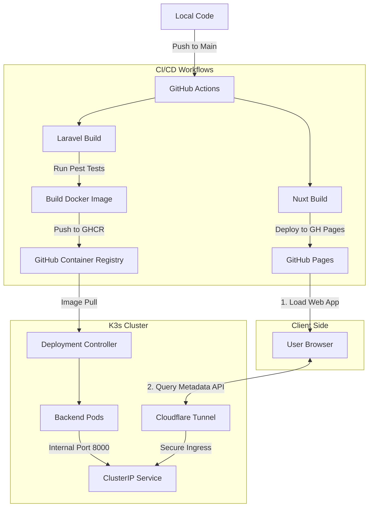

# Link Preview Studio

A decoupled application designed to extract, analyze, and visualize structured web metadata (Open Graph, Twitter Cards, Schema.org/JSON-LD).
Marketing teams frequently share URLs across platforms like Slack, Twitter/X, and LinkedIn, often without knowing how the destination platform's crawler will interpret their site's metadata. This tool provides an emulation of those platform-specific scrapers.

## Quick Start

### Live Deployment: [Link Preview Studio Live](https://link-preview-studio.lookitval.com)

### Local Development

This project is structured as a monorepo containing a disconnected frontend in *Nuxt.js* and a headless backend in *Laravel*.

#### Prerequisites

- Git (for cloning the repo)

- Docker Desktop (for Laravel Sail)
- PHP & Composer (for initial dependency installation)
- Node.js 18+ & npm/pnpm/yarn (for Nuxt.js)

#### Installation

1. Clone the Repository
```bash
git clone https://github.com/your-username/link-preview-studio.git
cd link-preview-studio
```

2. Start the Backend (Laravel Sail)
```bash
cd backend

# Load in basic environment variables
cp .env.example .env

# Install dependencies to pull in the Sail binary
composer install

# Start the Docker containers in the background
./vendor/bin/sail up -d

# Back Home
cd ..
```

3. Start the Frontend (Nuxt.js)
```bash
cd frontend

# Ensure the API base points to your local Sail instance
echo "NUXT_PUBLIC_API_BASE=http://localhost/api" > .env

# Install dependencies
npm install

# Start the development server
npm run dev
```

## Deployment & DevOps Architecture



### Infrastructure Logic & Flow

The architecture represents a strictly decoupled Static Front-end / Containerized Back-end pattern:

1. **Frontend Delivery**: The Nuxt.js application is built as a static site and served directly via GitHub Pages. This keeps deployment simple and ensures global availability of the UI assets to the user's browser.
2. **API Communication**: Once the browser loads the app, it initiates an fetch request to the backend. This request is routed through a Cloudflare Tunnel, which acts as a secure gateway to the private K3s cluster.
3. **Backend Processing**: The K3s cluster receives the request via a ClusterIP Service, which load-balances the traffic across multiple instances of the Backend Pods.

### GitHub Actions & CI/CD Logic

The automation logic resides in the root directory under .github/workflows/. These actions manage the lifecycle of both applications independently:

- **Frontend Workflow** `.github/workflows/frontend.yml`:
  - Triggered by changes in the frontend/ directory.
  - Installs dependencies, runs the Nuxt build, and utilizes the actions/deploy-pages action to push the build artifacts to the GitHub Pages environment.

- **Backend Workflow** `.github/workflows/backend.yml`:
  - Triggered by changes in the backend/ directory.
  - **Validation**: Executes php artisan test within a PHP environment before proceeding to the build phase. This ensures that no broken extraction logic reaches the container registry.
  - **Containerization**: Builds a production Docker image based on FrankenPHP.
  - **Registry**: Authenticates with GHCR and pushes the tagged image. The K3s cluster is configured with a node-agent that detects the new image and performs a rolling update of the Deployment.

### Self-Hosted K3s Setup

The backend is hosted on a local server managed by K3s (a lightweight Kubernetes distribution).

- **Internal Routing**: Traffic from the public internet never reaches the server directly. Instead, a Cloudflare Tunnel (cloudflared) creates a secure, encrypted outbound connection from within the local network to Cloudflare's edge.
- **Service Exposure**: The tunnel routes requests directly to a Kubernetes ClusterIP Service, which serves as the entry point for the backend pods running FrankenPHP/Octane. This setup allows the backend to remain entirely private (no open ports) while being globally accessible.

## Architectural Analysis

### Backend (Laravel Headless API)

#### 1. Minimalist API Interface

This API returns the full structured payload of the target URL. This allows the client-side "Studio" to visualize exactly how different platforms (Facebook, Twitter, Slack) would prioritize the data.

**Production Endpoint**: `https://link-preview-studio-api.lookitval.com/api/metadata`
- Method: `POST` / `GET`.
- Query Parameter: `q=[encoded_url]`

**Response Schema**:
```json
{
  "status": "success",
  "data": {
    "title": "Page Title",
    "description": "Meta description...",
    "meta": { "viewport": "...", "theme-color": "..." },
    "og": { "title": "...", "image": "...", "type": "article" },
    "twitter": { "card": "summary_large_image", "site": "@user" },
    "jsonLd": [ ... ],
    "icons": [ ... ],
    "fallback": {
      "image": "/path/to/extracted/img.png",
      "paragraph": "First significant text block used if meta is missing..."
    }
  }
}
```

#### 2. Data Flow

```mermaid
sequenceDiagram
    autonumber
    participant U as User (Frontend)
    participant B as Laravel API
    participant T as Target Website
    
    U->>B: POST /api/metadata {url}
    Note over B: SSRF & DNS Validation
    B->>T: HTTP GET (Spoofing User-Agent)
    T-->>B: 200 OK (HTML Source)
    
    rect rgb(40, 44, 52)
        Note over B: MetadataExtractor Waterfall
        Note right of B: 1. Extract standard meta tags (title, description)
        Note right of B: 2. Extract og: & twitter: tags
        Note right of B: 3. Parse JSON-LD (Schema.org)
        Note right of B: 4. Extract remaining meta tags 
        Note right of B: 5. Heuristic DOM Query (p tags, icons)
    end
    
    B-->>U: JSON {status: success, data: {...}}
```




## Frontend (Nuxt.js)

### Client-Side Logic

The frontend's primary responsibility is to interpret the verbose JSON payload from the API and map it to specific platform requirements. Since each social platform (Slack, LinkedIn, etc.) has its own unique "priority waterfall" for which tags it displays first, this allows each component to handle the tag mapping dynamically.

### Persistence Strategy: Why `localStorage`?

For session persistence and memory, everything is stored on the frontend using `localStorage`.
This approach ensures that everything is saved for the user without adding any complexity to the backend, and allowing the application to quickly restore the user's session state upon revisiting the site.
This does require a cookie notification to inform users that their session data is being stored locally.

## Requirements Checklist
(This is mostly for me to check off the boxes as I go)

### Must Haves
- [x] URL input field
- [x] Server-side URL fetch
- [x] Meta tag extraction
- [x] At least two platform preview cards
  - [x] Twitter
  - [x] Slack
  - [x] LinkedIn
  - [x] Facebook
- [x] Checked URL history
- [x] Error handling
  - [x] Invalid URL format
  - [x] Timeouts
  - [x] Pages with zero meta tags
  - [x] Non-200 HTTP responses
- [x] Cookie consent modal
- [x] README.md

### Nice to Haves
- [x] Additional platform preview card(s)
- [ ] A meta tag completeness checklist or "health score"
- [ ] Ability to copy any individual meta tag value to clipboard
- [x] Smooth transitions and micro-interactions in the UI
- [x] Dark mode & light mode switch
  - [x] 3 way toggle for dark/light/auto (system preference)
- [x] Mobile-responsive layout
- [ ] A UTM parameter builder that appends params to the URL before fetching
- [x] Live deployment

## Future Considerations

The next step is to implement more specialized scrapers. Right now the "Universal Waterfall" works for most sites, but platforms like Slack clearly use specialized techniques to pull richer information from big domains.

### 1. The Wikipedia / Content Driver

Wikipedia is a great example. Slack seems to pull significantly information from the actual body of the page when no descriptions are present.
I want to build a driver that targets the Lead Section: Specifically pulls the first 2-3 paragraphs from the Wikipedia content div rather than just the meta tags.

### 2. High-Fidelity Video Embedding (YouTube/Vimeo)

When you paste a YouTube link in Slack it embeds an actual video player. To emulate this, the scraper needs to pull specific data:
- **oEmbed Discovery**: Most professional platforms use the oEmbed spec (discovered via `<link rel="alternate" type="application/json+oembed">`). This provides the exact iframe HTML, dimensions, and provider information needed for an inline embed.
- **YouTube Specifics**: Pulling `og:video:url` and `og:video:secure_url` specifically allows Slack to "unfurl" the video into a native-feeling player without the user leaving the chat. I'll be adding a "Playable Preview" mode to my Studio to emulate this behavior.

### 3. Specialized Page Summaries

Beyond video and wiki content, several other page types deserve custom rendering logic and should be looked into:
- **E-commerce (Amazon/Shopify)**: Scrapers might pull data from price or reviews in some previews.
- **Professional Profiles (LinkedIn)**: Scrapers might pull specific data such as company information or job posting details (like location and salary range) from JSON-LD schemas.
- **Documentation (GitHub/MDN)**: Scrapers might pull repo statistics (stars, forks) or documentation breadcrumbs.